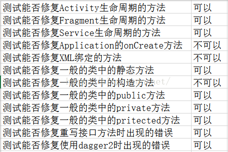

# AndFixUsage
使用AndFix实现热修复方案

> 这个项目使用[AndFix](https://github.com/alibaba/AndFix)来实现热修复的支持

#### 我们打算在产品中引入热修复的方案，这个项目是我将AndFix引入项目前做的一些准备工作和测试工作。

1. 在Application中初始化热修复。
2. 修改OnMain中的方法，通过apatch工具生成apatch文件，来测试热修复的效果。
3. 尝试从网络端获取apatch，用作实际场景中获取apatch的逻辑。并对apatch做md5校验。
4. 在Application启动的时候，遍历下载的apatch列表，校验其签名，如果校验通过，则添加到patchManager中去，否则删掉非法的apatch。
5. apatch有可能会出现修复失败的情况，对这种情况，客户端进行全局异常捕捉，当应用出现连续崩溃的时候，启用自恢复逻辑，即清理本地的apatch。

#### apkpatch

```
usage: apkpatch -f <new> -t <old> -o <output> -k <keystore> -p <***> -a <alias> -e <***>
 -a,--alias <alias>     keystore entry alias.
 -e,--epassword <***>   keystore entry password.
 -f,--from <loc>        new Apk file path.
 -k,--keystore <loc>    keystore path.
 -n,--name <name>       patch name.
 -o,--out <dir>         output dir.
 -p,--kpassword <***>   keystore password.
 -t,--to <loc>          old Apk file path.
 ```

 我自己的执行脚本为:

 ```
 ~/Downloads/apkpatch-1.0.3/apkpatch.sh -f weiconote_new.apk -t weiconote_old.apk -o out -a androiddebugkey -e android -p android -k debug.keystore -n out.patch
 ```


#### 需要了解注意的几点

- 目录是自己指定的，apatch文件也是可以自己进行管理的。

- patch文件在被 mPatchManager.addPath 处理之后，会拷贝到应用自己的私有目录下进行备份，备份的时候是以当前的文件名来进区别。也就是说同名的apatch文件只会添加一次。

- apatch 文件会被 mPatchManager 根据版本号进行管理，当版本号升级之后，对应的补丁不再生效（如果出现导致崩溃的补丁，可以通过升级版本号来使其失效，当前也可以通过自己编码来对 mPatchManager 管理的补丁进行管理【已实现】）

- 当对某个版本进行连续打补丁时，分别生成了版本A 版本B 版本C，其中c中包含了AB的修改，是能够正常修复且不冲突的。

- 并不是所有的功能点都能通过补丁进行修复。比如添加了新的方法、新的内部类等等，限制比较多，所以应当仅作为紧急补丁进行处理，不能作为常规开发进行调整。网友总结的一些限制：
